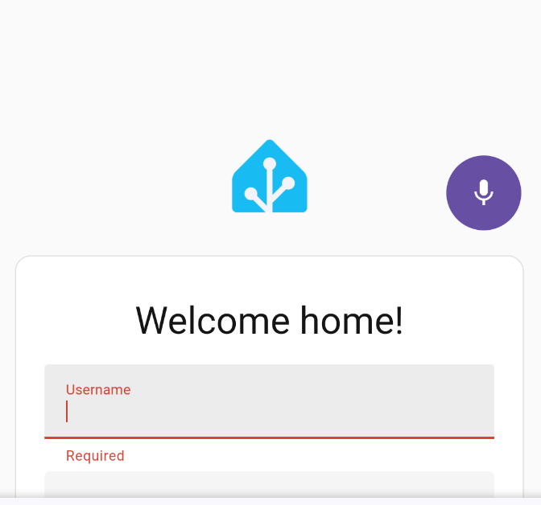

# Flo

A fully private, local voice-to-text app for Android. Unlike alternatives that send your screen contents and keystrokes to remote servers, Flo only streams audio to a Whisper server **you control** on your own network. Nothing leaves your device except the audio you explicitly record.

Uses a floating bubble overlay — hold the bubble, speak, release — your speech is transcribed and pasted into the active text field.

Powered by [Wyoming Whisper](https://github.com/rhasspy/wyoming-faster-whisper) for speech-to-text, running on your own hardware.

The purple mic bubble appears on top of all apps when you tap into a text field. Tap and hold to record, release to transcribe and paste.



## How it works

1. An accessibility service detects when you focus a text field and shows a floating mic bubble
2. Press and hold the bubble to stream audio to your Wyoming Whisper server over TCP
3. Release to get the transcription back and paste it at your cursor position

## Setup

### Server

Run Wyoming Whisper via Docker:

```bash
docker run -d \
  -p 10300:10300 \
  rhasspy/wyoming-whisper \
  --model small --language en
```

I run this on a server with a GPU over Tailscale, and use whisper v3 large with great results.

### App

1. Build and install the APK (or download from releases)
2. Open Flo and enter your Wyoming Whisper server IP and port (default `10300`)
3. Grant microphone and overlay permissions
4. Enable the Flo accessibility service
5. Open any app, tap a text field — the purple mic bubble appears on the right edge

## Building

Requires Android SDK with platform 35 and Java 17.

```bash
./gradlew assembleDebug
```

The APK will be at `app/build/outputs/apk/debug/app-debug.apk`.

## Architecture

```
app/src/main/java/com/flo/whisper/
├── ui/MainActivity.kt              — Settings (host, port, language, permissions)
├── service/FloAccessibilityService.kt — Text field detection, bubble, recording, paste
├── overlay/BubbleView.kt           — Custom bubble with recording/processing states
└── wyoming/WyomingClient.kt        — Wyoming protocol TCP client
```
